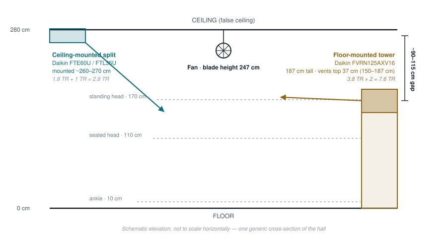

# Hall Survey — First Pass

Based on the hand-drawn layout, hall photos, switchboard photos, and walkthrough
video supplied 2026-09-02. This replaces guesswork in
[Design Considerations §2](design-considerations.md#2-phase-0--the-survey-you-must-do-before-buying-hardware)
with what's now actually known, and narrows what's still open.

## 1. Layout

- Rectangular hall, 2,400–2,500 sq ft, entrance at one short end, the pulpit at
  the opposite ("front") end.
- **12 fans in a 4×3 grid** — 4 fans deep (front to back), 3 columns per side
  plus a denser center block. **Fan numbers on the diagram are the
  switchboard's own numbering** (see §3) — there's now one canonical ID per
  fan, not a separate spatial label to translate.
- **Seating is not uniform.** A large block seats consistently under the
  center 6 fans (4, 5, 6, 7, 8, 9). Two corner pockets (1, 10) are also
  consistently seated. The two pockets nearest the doors (3, 12) taper off —
  fewer people sit that close to the entrance. This matters directly for
  sensor priority (§4) and eventually for which fans matter most to control
  tightly.
- **Seating faces the pulpit, not just "forward."** Confirmed by the updated
  sketch: chairs away from the center column turn inward toward the pulpit
  rather than sitting in uniform forward-facing rows — shallowest angle at the
  front corners (fans 1, 10), steepest at the back corners (fans 3, 12), with
  the center column (4–9) facing straight ahead since it's already on-axis.
  Overall the seating reads as a C/horseshoe curving around three sides of the
  room, opening toward the pulpit. **This is a Phase 2 enclosure detail worth
  remembering:** a chair-integrated sensor housing designed for one chair
  orientation won't drop in cleanly on a chair angled 30–50° differently in
  another zone — the print design needs to account for varying chair angle by
  zone, not assume one orientation hall-wide.
- **4 ACs, 2 types, one type per side** — confirms the original problem
  statement. 2 ceiling-mounted units on the left wall, 2 floor-mounted tower
  units on the right wall.
- Fan switchboard and a power point are at the entrance end, left side.

## 2. Ceiling: false ceiling, perforated metal tile

The hall has a suspended/false ceiling in perforated metal tiles, standard
grid system. This matters for Phase 2 in two ways:

- **Ceiling-level sensors (the DS18B20 stratification leg, sensor-node-spec.md
  §3) can potentially clip into the ceiling grid** rather than needing a
  separate bracket — worth checking the tile/grid spec when you're there next.
- Pendant-mount fans hang below the ceiling on a drop rod — sensor housings at
  fan height need to clear the swept blade radius, not just sit near the fan.

## 3. Fan switchboard — the wiring question is resolved, favorably

This was the single highest-risk unknown in the whole project (design-
considerations.md §2: *"twelve fans are very often not twelve independent
circuits"*). The photo answers it:

**Each of the 12 fans has its own individual ON/OFF switch and its own
individual speed-regulator knob, all landing at one switchboard location**
near the entrance. Two panels hold 6 switch+regulator pairs each — laid out as
`knob(reg) — switch — switch — knob(reg)` per plate, each plate covering 2
fans, labeled 1–12 on tape.

This is the best possible outcome:

- **No electrical ganging to work around.** Every fan is independently
  switchable already — nothing described in design-considerations.md's "fans
  wired in banks" risk scenario applies here.
- **Installation work concentrates in one place.** An electrician (or you,
  bench-testing first per sensor-node-spec.md §9) doesn't need to open 12
  separate ceiling boxes — every fan's line is accessible at this one
  switchboard.
- **The existing regulators solve speed control for free.** sensor-node-
  spec.md §9 already recommended on/off-only automation with speed fixed
  manually — that's exactly this hardware. Leave the regulator knobs as they
  are; automate only the ON/OFF switch leg, in parallel with or replacing the
  existing rocker.

The separate panel with 10 plain rocker switches and 2 power sockets is
**confirmed to be the hall lighting circuits**, not fans. That power socket
location is a convenient spot to bench-power a Raspberry Pi or relay
controller later, since it's already at the same wall as every fan's wiring.

### Switchboard number ↔ hall position

Confirmed by manually testing each switch. This is now each fan's one
canonical ID — used on the diagram in §1 and in every doc from here on.

| Fan (switch #) | Position |
|---|---|
| 1 | Right wall, front |
| 2 | Right wall, middle |
| 3 | Right wall, back (near doors — tapering seating) |
| 4 | Center-right column, front |
| 5 | Center-right column, middle |
| 6 | Center-right column, back |
| 7 | Center-left column, front |
| 8 | Center-left column, middle |
| 9 | Center-left column, back |
| 10 | Left wall, front |
| 11 | Left wall, middle |
| 12 | Left wall, back (near doors — tapering seating) |

The numbering runs in clean column order — right wall (1–3), center-right
column (4–6), center-left column (7–9), left wall (10–12), each top-to-bottom
— which is a good sign the switchboard was wired methodically and this mapping
is reliable, not something stitched together ad hoc.

## 4. AC identification — resolved, with one correction

| | Model | Capacity | Type | Refrigerant | Power |
|---|---|---|---|---|---|
| Floor-mounted tower ×2 | Daikin FVRN125AXV16 | 3.8 TR | Non-inverter, 3-phase | R-410A | 380–415V, 3-ph |
| Ceiling-mounted split | Daikin FTE60UV16 | 1.8 TR, 1★ | Non-inverter, 1-phase | R-32 | 230V, 1-ph |
| Ceiling-mounted split | Daikin FTL35UV16 | 1 TR, 3★ | Non-inverter, 1-phase | R-32 | 230V, 1-ph |

**Correction to flag:** the notes named the ceiling-mounted units as
Mitsubishi, but every retailer listing for both `FTE60UV16` and `FTL35UV16`
identifies them as **Daikin** — these model-number prefixes (FTE, FTL) are
Daikin's own residential split-AC naming, not Mitsubishi's. Worth a second
look at the physical nameplate/logo to confirm, but if the model numbers are
right, **all four ACs in the hall are Daikin** — one brand, not two. That's
good news for later: one IR/BMS protocol family to integrate against instead
of two, when design-considerations.md §7 (AC-side control) comes up.

Also — the "ceiling-mounted" units turn out to be **standard high-wall split
indoor units**, not ceiling-suspended cassette units as the photo shape
suggested. They just sit unusually high (260–270 cm, in a 280 cm room) — see
§5, which is exactly what made them read as "ceiling-mounted" both in person
and in the earlier photo analysis.

### This quantifies why the hall has hot and cold pockets

Two numbers explain the imbalance the whole project exists to fix:

- **Capacity is lopsided 2.7× toward the tower side.** Left wall (ceiling
  splits): 1.8 + 1 = **2.8 TR**. Right wall (towers): 3.8 × 2 = **7.6 TR**.
- **Discharge height differs by ~90–115 cm between the two types** — see the
  cross-section in §5. The tower units push air out around chest/shoulder
  height (150–187 cm); the ceiling splits push it out just under the ceiling
  (260–270 cm), a full storey higher, with more room to stratify or miss the
  occupied zone before it's felt.

So the right side of the hall gets nearly 3× the cooling, delivered close to
where people actually are; the left side gets much less, delivered from
almost the ceiling. That asymmetry — not just "two different AC types" in the
abstract — is the mechanism design-considerations.md §1 was theorizing about
generically. It's now measured, not assumed.

## 5. Vertical profile — mounting heights

Measurements as given: ceiling 280 cm · fans at 247 cm blade height · ceiling
splits mounted 260–270 cm · tower units 187 cm tall with vents in the top
37 cm (150–187 cm off the floor).

Two things worth carrying into Phase 2 sensor placement:

- **Fans sit below both AC discharge heights**, which is the right place for
  them — they're positioned to catch air from either type before it settles,
  not above the disturbance.
- **The tower side may not stratify the same way the split side does.** A
  vent at 150–187 cm is throwing air roughly through the seated/standing head
  zone directly, rather than from the ceiling down through it. Worth
  considering a sensor at tower-vent height (~165 cm) on that side specifically
  during Phase 2, in addition to the occupied-zone and ceiling sensors already
  planned in sensor-node-spec.md §4 — the two sides of the hall may turn out to
  need different sensor heights to characterize properly, not identical rigs.

## 6. Updated open questions

Cross-referencing design-considerations.md §13:

| # | Question | Status |
|---|---|---|
| 1 | Ceiling height, flat or vaulted | **Resolved — flat, false ceiling, 280 cm** |
| 2 | How are the 12 fans switched | **Resolved — individually, see §3** |
| 3 | Neutrals in switch boxes | Still open — check when at the switchboard |
| 4 | AC make/model, IR or wired/BMS | **Resolved — see §4** (wired/BMS vs. IR-only still to confirm) |
| 5 | Other uses / schedule for the hall | Still open |
| 6 | Typical/peak occupancy | Still open — seating layout (§1) confirms it varies sharply by zone, not just by day |
| 7 | Solar gain / window orientation | Windows confirmed present (curtained) on at least one wall — orientation not yet known |
| 8 | Heated in winter? | Still open |
| 9 | Who else can maintain this | Still open |
| 10 | Budget / approval | Superseded — see project-context.md (no fixed budget) |
