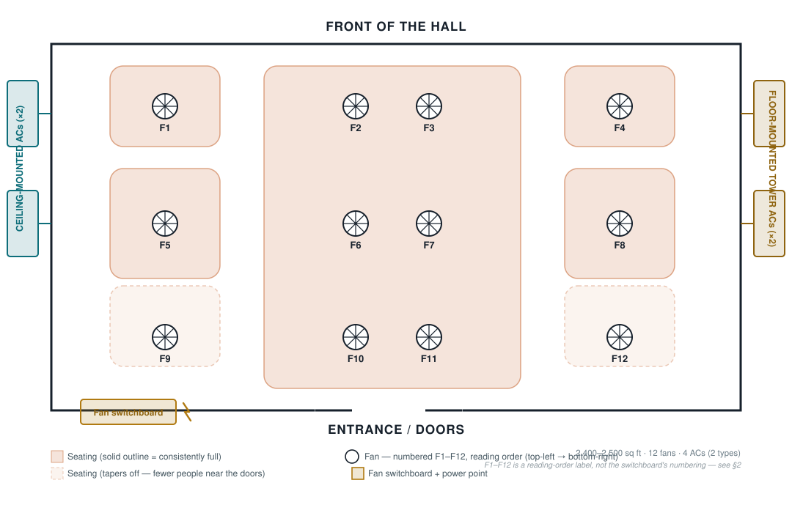

# Hall Survey — First Pass

Based on the hand-drawn layout, hall photos, switchboard photos, and walkthrough
video supplied 2026-09-02. This replaces guesswork in
[Design Considerations §2](design-considerations.md#2-phase-0--the-survey-you-must-do-before-buying-hardware)
with what's now actually known, and narrows what's still open.

## 1. Layout

- Rectangular hall, 2,400–2,500 sq ft, entrance at one short end, opposite the
  "front."
- **12 fans in a 4×3 grid** — 4 fans deep (front to back), 3 columns per side
  plus a denser center block.
- **Seating is not uniform.** A large block seats consistently under the
  center 6 fans (F2, F3, F6, F7, F10, F11). Two corner pockets (F1, F4) are
  also consistently seated. The two pockets nearest the doors (F9, F12) taper
  off — fewer people sit that close to the entrance. This matters directly for
  sensor priority (§4) and eventually for which fans matter most to control
  tightly.
- **4 ACs, 2 types, one type per side** — confirms the original problem
  statement. 2 ceiling-mounted units on the left wall, 2 floor-mounted tower
  units on the right wall.
- Fan switchboard and a power point are at the entrance end, left side.

The **F1–F12 numbering above is a reading-order label I assigned for this
document** — top-left to bottom-right — not the switchboard's own numbering.
See §3.

## 2. Ceiling: false ceiling, perforated metal tile

The hall has a suspended/false ceiling in perforated metal tiles, standard
grid system. This matters for Phase 2 in two ways:

- **Ceiling-level sensors (the DS18B20 stratification leg, sensor-node-spec.md
  §3) can potentially clip into the ceiling grid** rather than needing a
  separate bracket — worth checking the tile/grid spec when you're there next.
- Pendant-mount fans hang below the ceiling on a drop rod — sensor housings at
  fan height need to clear the swept blade radius, not just sit near the fan.

## 3. Fan switchboard — the wiring question is resolved, favorably

This was the single highest-risk unknown in the whole project (design-
considerations.md §2: *"twelve fans are very often not twelve independent
circuits"*). The photo answers it:

**Each of the 12 fans has its own individual ON/OFF switch and its own
individual speed-regulator knob, all landing at one switchboard location**
near the entrance. Two panels hold 6 switch+regulator pairs each — laid out as
`knob(reg) — switch — switch — knob(reg)` per plate, each plate covering 2
fans, labeled 1–12 on tape.

This is the best possible outcome:

- **No electrical ganging to work around.** Every fan is independently
  switchable already — nothing described in design-considerations.md's "fans
  wired in banks" risk scenario applies here.
- **Installation work concentrates in one place.** An electrician (or you,
  bench-testing first per sensor-node-spec.md §9) doesn't need to open 12
  separate ceiling boxes — every fan's line is accessible at this one
  switchboard.
- **The existing regulators solve speed control for free.** sensor-node-
  spec.md §9 already recommended on/off-only automation with speed fixed
  manually — that's exactly this hardware. Leave the regulator knobs as they
  are; automate only the ON/OFF switch leg, in parallel with or replacing the
  existing rocker.

There's a separate panel with 10 plain rocker switches (labeled 5–10 and 1–4)
and 2 power sockets. Those aren't fan switches — no regulators next to them —
almost certainly the hall lighting circuits. Worth confirming, and **that
power socket location is a convenient spot to bench-power a Raspberry Pi or
relay controller** later, since it's already at the same wall as every fan's
wiring.

**Open item:** the switchboard's fan numbers (1–12) haven't been matched to
physical positions in the hall (F1–F12 above). Cheapest way to get this: turn
on one fan at a time from the switchboard and note which one spins. Worth
doing in the same visit as the RF survey (sensor-node-spec.md §8, test 2) —
you'll already be walking the hall fan-by-fan.

## 4. AC identification — inconclusive from photos, here's what to get

I looked at the AC photos and pulled frames from the walkthrough video. Neither
gives a reliable read on make/model:

- The **floor-mounted tower units** (right wall) are visible closely enough to
  guess at a manufacturer, but a guess is exactly the wrong thing to hand you
  for something you'll use to order an IR blaster or look up a datasheet — a
  misread brand sends you down the wrong path entirely.
- The **ceiling-mounted units** (left wall) are large, elongated, mounted
  tight against the ceiling — consistent with a "ceiling suspended" ductless
  indoor unit rather than a standard high-wall split (which is smaller/more
  square) or a cassette (which sits flush inside the ceiling grid, not hanging
  below it). That's a shape observation, not a brand identification.

**What actually resolves this:** every AC indoor and outdoor unit carries a
**rating label / nameplate** — a sticker, usually on the side or back panel
(sometimes behind a small flap), listing brand, exact model number, capacity
(tons or BTU/hr), refrigerant type, and often a QR code. That's the
authoritative source design-considerations.md §2 originally asked for
("Model numbers, capacity... whether they have a wired controller, IR remote,
or any BMS/Modbus interface").

**Action step:** next visit, photograph the nameplate on one unit of each type
(one ceiling-mounted, one floor-mounted tower) — close enough to read the
model number — plus whichever remote control or wall controller is used for
each. That's a 5-minute job and it's the one piece of data that unblocks
Phase 4 AC-side integration (design-considerations.md §7, "Do not forget the
ACs themselves").

## 5. Updated open questions

Cross-referencing design-considerations.md §13:

| # | Question | Status |
|---|---|---|
| 1 | Ceiling height, flat or vaulted | Flat, false ceiling — height still not measured |
| 2 | How are the 12 fans switched | **Resolved — individually, see §3** |
| 3 | Neutrals in switch boxes | Still open — check when at the switchboard |
| 4 | AC make/model, IR or wired/BMS | Still open — nameplate photo needed, §4 |
| 5 | Other uses / schedule for the hall | Still open |
| 6 | Typical/peak occupancy | Still open — seating layout (§1) suggests it varies by zone, not just by day |
| 7 | Solar gain / window orientation | Windows confirmed present (curtained) on at least one wall — orientation not yet known |
| 8 | Heated in winter? | Still open |
| 9 | Who else can maintain this | Still open |
| 10 | Budget / approval | Superseded — see project-context.md (no fixed budget) |
